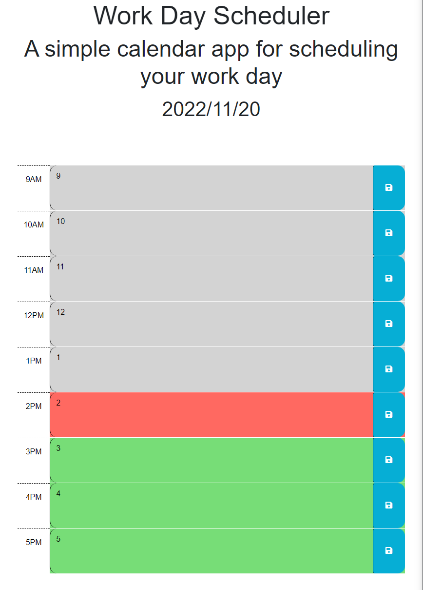

# Work Day Scheduler
Link to repo - https://github.com/cridder/WorkDayScheduler

Link to page - https://cridder.github.io/WorkDayScheduler

## Your Task
- [X] Create a simple calendar application that allows a user to save events for each hour of the day by modifying starter code.  This app will run in the browser and feature dynamically updated HTML and CSS powered by jQuery.

- [X] You'll need to use the [Day.js](https://day.js.org/en/) library to work with date and time. Be sure to read the documentation carefully and concentrate on using Day.js in the browser.

## User Story
- [X] AS AN employee with a busy schedule
- [X] I WANT to add important events to a daily planner
- [X] SO THAT I can manage my time effectively

## Acceptance Criteria
- [X] GIVEN I am using a daily planner to create a schedule
- [X] WHEN I open the planner
    - [X] THEN the current day is displayed at the top of the calendar
- [X] WHEN I scroll down
    - [X] THEN I am presented with timeblocks for standard business hours
- [X] WHEN I view the timeblocks for that day
    - [X] THEN each timeblock is color coded to indicate whether it is in the past, present, or future
- [X] WHEN I click into a timeblock
    - [X] THEN I can enter an event
- [X] WHEN I click the save button for that timeblock
    - [X] THEN the text for that event is saved in local storage
- [X] WHEN I refresh the page
    - [X] THEN the saved events persist

## Screenshot

